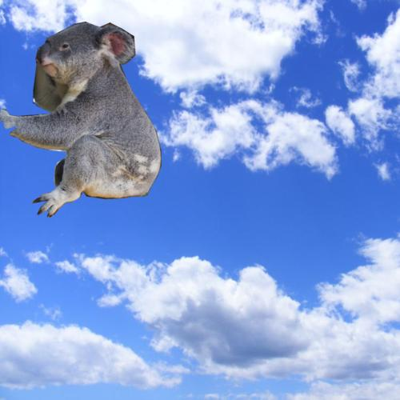
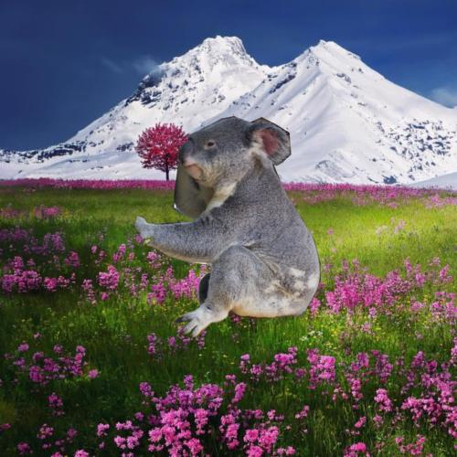
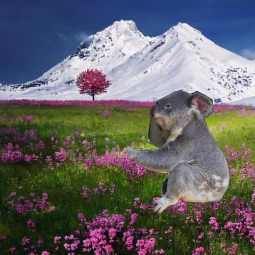
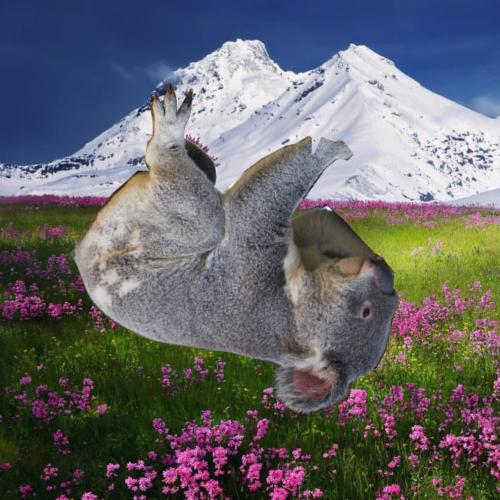

# SI-SCORE: Synthetic Interventions on Scenes for Robustness Evaluation

As we begin to bring image classification models into the real world, it is important that they are robust and do not overfit to academic datasets. While robustness is hard to define, one can think of intuitive factors that image classification models should be robust to, such as changes in object location or differing weather conditions. Models should at least be robust to these factors. To test this, ideally we would have datasets that vary only these factors. For some factors such as image compression and differing weather conditions, datasets such as Imagenet-C already exist, whereas for common-sense factors such as object size and object location, such datasets did not yet exist prior to SI-SCORE.

In SI-SCORE, we take objects and backgrounds and systematically vary object size, location and rotation angle so we can study the effect of changing these factors on model performance. We also provide the code, object images and background images and hope that researchers can create their own datasets to test robustness to other factors of variation.

Here are some sample images from the dataset:

  

  

## Citing this dataset
When using this dataset, please cite our paper [On Robustness and Transferability of CNNs (Djolonga et. al., 2020)](https://arxiv.org/abs/2007.08558). There are also more dataset details in Appendix D of the paper. 

Here is the Bibtex entry for the paper:
```
@misc{djolonga2020robustness,
      title={On Robustness and Transferability of Convolutional Neural Networks}, 
      author={Josip Djolonga and Jessica Yung and Michael Tschannen and Rob Romijnders and Lucas Beyer and Alexander Kolesnikov and Joan Puigcerver and Matthias Minderer and Alexander D'Amour and Dan Moldovan and Sylvain Gelly and Neil Houlsby and Xiaohua Zhai and Mario Lucic},
      year={2020},
      eprint={2007.08558},
      archivePrefix={arXiv},
      primaryClass={cs.CV}
}
```

## Downloading the dataset
The dataset is hosted by CVDF in an AWS s3 bucket. You can download the data by [installing the AWS CLI tool](https://docs.aws.amazon.com/cli/latest/userguide/install-cliv2.html) and running the following command
```
aws s3 cp s3://si-score-dataset/object_{size|location|rotation}/ . --recursive 
```
choosing one of `size`, `location` or `rotation` depending on which dataset you want to download.

The browser link to the s3 bucket is `https://s3.us-east-1.amazonaws.com/si-score-dataset/`, but it seems that you can only download single files through the browser. (e.g. [here is the link to a foreground classes CSV](https://s3.us-east-1.amazonaws.com/si-score-dataset/object_location/foreground_classes.csv).)

## Generating your own synthetic dataset
To generate your own synthetic dataset, you can run `generator_script.py` while modifying the config to fit your needs. You can also extend this functionality beyond varying object size, location, and rotation angle by editing `dataset_generator.py`.

Some sample foreground and background images are included in this repository. You can download the full set of foreground and background images by [installing the AWS CLI tool](https://docs.aws.amazon.com/cli/latest/userguide/install-cliv2.html) and running the following command
```
aws s3 cp s3://si-score-dataset/{foregrounds|backgrounds}/ . --recursive 
```
choosing either `foregrounds` or `backgrounds` as appropriate.

To can then change the arguments `foregrounds_dir`, `backgrounds_dir` in lines 108-109 of `generator_script.py` to use these foregrounds and backgrounds instead of `foreground_samples/` and `background_samples/`.

### Important points to note when generating a dataset


1. When comparing different rotation angles, we advise comparing rotation angles that are not in the set [0, 90, 180, 270] with those outside of this set. This is because certain rotations may be more blurry than others, making the comparison unfair. This is also why we compare rotation angles [1, 21, 41, ... 341] instead of [0, 20, 40, ..., 340] in the paper.
2. In the object size and rotation angle datasets used in the paper, the `min_pct_in_image` parameter is set to `0.95`. This means that if less than 95% of the foreground object is in the image, the image will not be generated and added to the dataset. This was put in place to avoid occlusion becoming a confounding factor. However, this led to certain classes being included more often than other classes when foreground objects were large or when objects were close to borders of the image. This greatly changed the results for the location dataset since different classes are excluded for different object locations (specifically accuracy was higher near the vertical edges when horizontal objects were excluded), which is why we generated multiple location datasets in the paper with different values of `min_pct_in_image`. Therefore, our current recommendation is to set this percentage to 0 and be mindful that occlusion may contribute to results. This is also the new default used in the code in this repository.

## Tests

This code comes with unit tests in `generator_test.py` and `generator_utils_test.py`. These tests rely on the `foreground_samples/` and `background_samples/` directories staying the way they are.

## Foreground and background images attributions

The foreground images are segmented from OpenImages, which comprises CC-licensed images. In the big foregrounds directory, each image has a name of the form `{OpenImagesID}_{num1}_{num2}`.

The attributions for each image can be found on the [OpenImages website](https://storage.googleapis.com/openimages/web/download.html) in the Image IDs CSVs.

The background images hosted on CVDF all come from Pexels.com and carry a Pexels license. Some images in the `background_samples/` directory do not carry a Pexels license. The attributions for these images are listed in `samples_attributions.md`.
